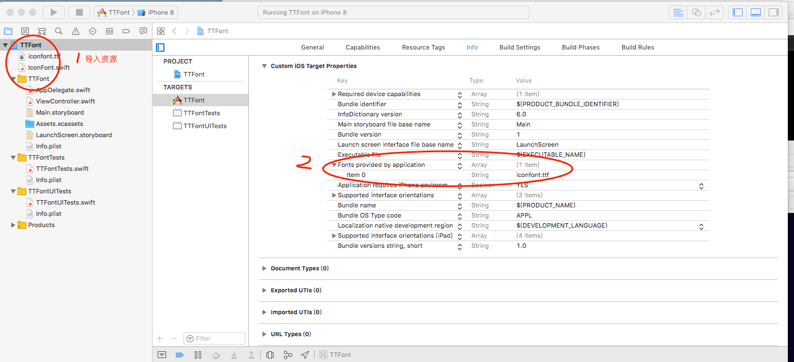

IconFont 使用教程

1.登录 [阿里iconfont](http://www.iconfont.cn)下载一个iconfont.ttf文件

2.导入字体配置info.plist

3.使用实例

~~~
class ViewController: UIViewController {

    override func viewDidLoad() {
        super.viewDidLoad()
        
        // 打印所有字体名称，字体名称已实际为准,可能和导入的文件名称不同
        let arr = UIFont.familyNames
        print(arr)
        
        // 下载的字体文件中会有一个demo_unicode 将&#xe6ae 修改成\u{e6ae} 使用
        let btn = UIButton.init(frame: CGRect(x:100,y:100,width:100,height:80))
        btn.backgroundColor = UIColor.blue
        btn.titleLabel?.font = UIFont.iconfont(size: 60)
        btn.setTitle("\u{e6ae}", for: .normal)
        self.view.addSubview(btn)
    }
}

~~~